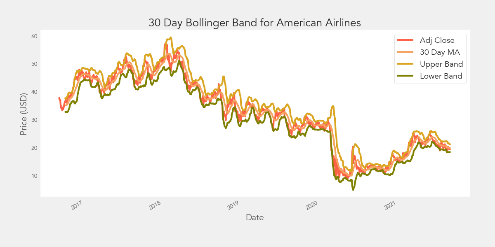

# Airlines Stocks Evaluation 


## Author
* Mia Fryer

## Table of Contents
* [Motivation](#Motivation)
* [Data Sources](#Data_Sources)
* [Feature Engineering/Technical indicators](#Feature_Engineering_Technical_indicators)
* [Data Preparation](#data-preparation)
* [Model Training and Testing](#model-training-and-testing)
* [Analysis](#analysis)
* [Conclusions](#conclusions)
* [Project Structure](#project-structure)

## Motivation
Stock investing without any stratgies can be daunting to decide which to buy. The goal of this project is to bring clarity via a Machine Learning driven dashboard for analyzing and forecasting changes amongst the four major american alines: Southwest, American, Delta and United airlines. Visualizing closing price performance for these airlines at once is a valuable tool for to easily identify trends and do side by side comparison.  Both ARIMA/SARIMA and LSTM neural network produce price forecasts to faciliate investors to make informed investment decisions.


## Data Sources
One of the most important steps in machine learning and predictive modeling is gathering good data. For this project, the data is loaded from Yahoo Finance using pandas DataReader function.

## Feature Engineering/Technical indicators
Financial analysts use a number of technical indicators, the one's including in this project are the following: 

• Moving Average Convergence Divergence (MACD): A momentum indicator to spot increasing short-term momentum using the difference between a short-term(12) and long-term(26 exponential moving average. Generally speaking, when a short-term moving average crossing below a longer-term average is used to illustrate that the asset's price has been moving downward at a faster rate and that it may be a good time to sell. The reverse will also be true for a bullish momemtum and that can be represneted with a positive MACD value. 

• Bollinger Bands: A statistical chart characterizing the prices and volatility over time. The chart is plotted using the moving average of 20 days and two standard deviations of the rolling average as the upper bound and lower bound. A common approach when using Bollinger Bands® is to identify overbought or oversold market conditions. When the price of the asset breaks below the lower band of the Bollinger Bands®, prices have perhaps fallen too much and are due to bounce. On the other hand, when price breaks above the upper band, the market is perhaps overbought and due for a pullback.



• Relative Strength Index (RSI): A momentum oscillator which ranges from 0 to 100. Funds with over 70 or under 30 are traditionally identified as having strong momentum up or down. The RSI is calculated over a period of 14 days, and is a function of relative strength(RS), a ratio of exponentially smoothed moving averages of up and down periods during this time.

• Moving Average Convergence Divergence (MACD): A momentum indicator which is used to identify trends over time. it is a function of the 12 and 26 day EWMAs.


## Data Preparation
The images where first sorted into two folders: pneumonia and normal. The images were then further sorted with a ratio of 60:20:20 in three folders: train, validation, and test. 

We also split the pneumonia images further into bacterial and viral pnuemonia folders, and the split the images into train, validation, and test folders using the same ratio as above.

Using an image data generator, we rescaled each pixel by a factor of 1/255, resized the images to (64,64), and changed images to gray scale. We had a different image data generator for train, validation, and test images. We used the generators and the next() funtion to extract the images and corresponding labels. We further explored the data by spliting the pneumonia files into bacterial and viral infection and repeat the same steps to create generatros for train, test and validation data set. 

## Model Training and Testing
We tested out 6 models in addition to a dummy model:

<ol start="0">
  <li> Dummy Classifier Model (using stratify)</li>
  <li>Baseline Neural Network</li>
  <li>Neural Network with Dense Layers</li>
  <li>Neural Network with Dense and Drop Layers</li>
  <li>Convolutional Neural Network (CNN)</li>
  <li>CNN with Class Weights</li>
  <li>CNN with Focal Loss</li>
</ol>

For model 0, the dummy classifier, with fit the model on the train images and labels, and applied the fitted model to the train data. For models 1-6, we complied and fit the model on the train data, passing in the validation set as well. We used the model to evaluate the test data.


## Analysis
For our analysis, we wanted to focus on the recall metric because we wanted to reduce the number of false negatives or wrongly classifying patients as non-pneumonia when in fact they have pneumonia. In the medical field, the term sensitivity is synonymous to recall.

Our dummy classifier model has a recall of 72%.

As for the other models, the following graph shows the recall metric per model.

We found that model 2 was the best model with the highest recall score. The following is the confusion matrix of model 2.


## Conclusions
Given the high recall or sensitivity score, we recommend ACME Health to pilot our binary model with their physicians and compare the model results with the physicians' diagnoses. We believe that the model can help increase pneumonia diagnosis sensitivity, reduce the time it takes to diagnose pneumonia, and allow physicians to reallocate their time into other work. As for the multi-class model, we do not recommend Acme Health to use this model at this time. We would like to do further work on the model and try to obtain more images to improve the model's performance.

## Next Steps
Though our model can aid ACME health to diagnose patients without a physician, this may need to be first approved by health insurers, as some reimbursements require a physician's input. In addition, we would like to test or re-train our models on chest X-ray images of people in other ages groups, especially those who are ages 65+ who may be more prone to infection. Finally, we would like to run similar models to detect other respiratory conditions such as chronic obstructive pulmonary disease.

## Project Structure
```
.
├── 01_EDA.ipynb
├── 02_ARIMA_SARIMA.ipynb 
├── 03_Expoential_model.ipynb  
├── 04_LSTM_single_step.ipynb
├── 05_LSTM_multstep.ipynb.ipynb
├── 06_Multiclass_Modeling.ipynb
├── README.md
├── Airline_Stocks_Presentation.pdf
├── gitignore
└── images
 
   
```
