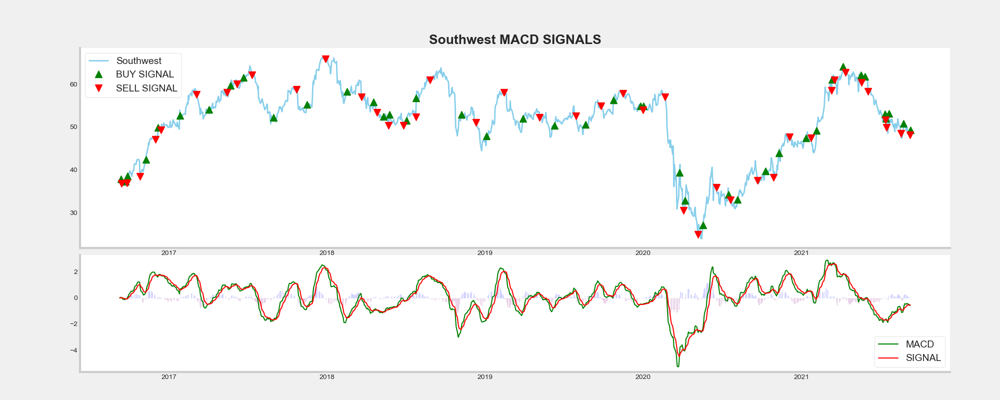
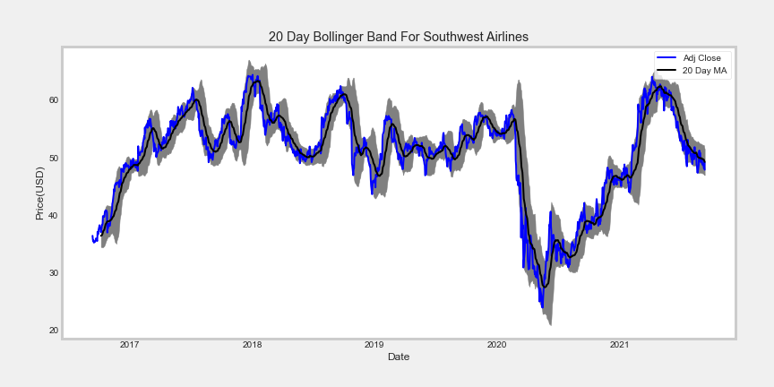
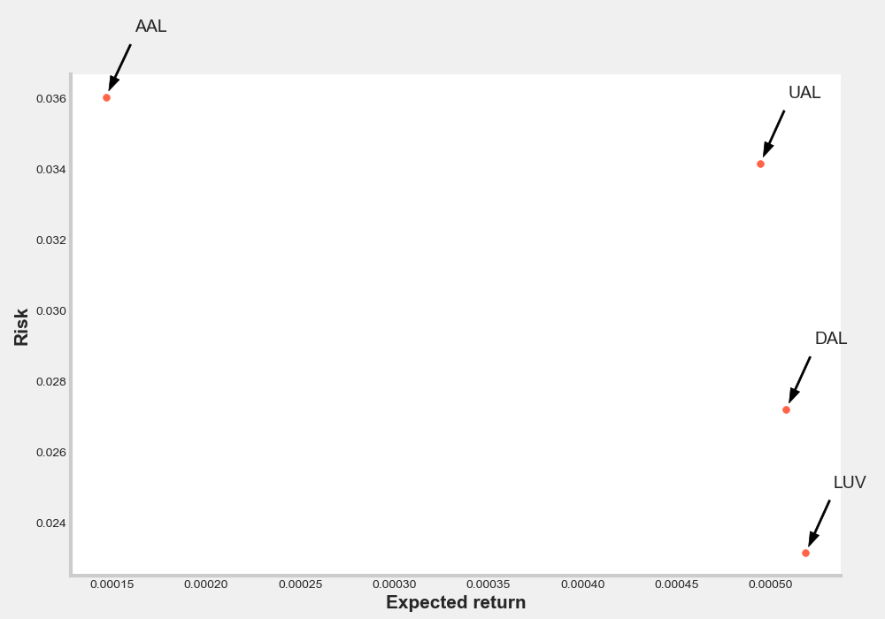
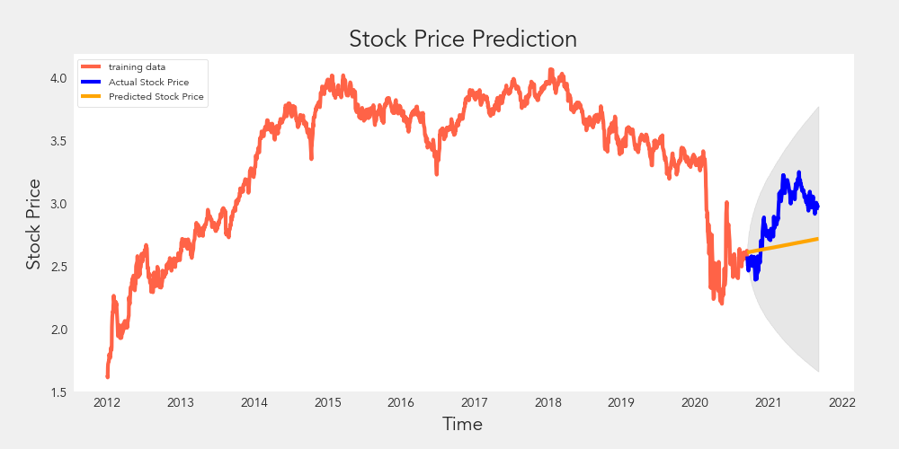
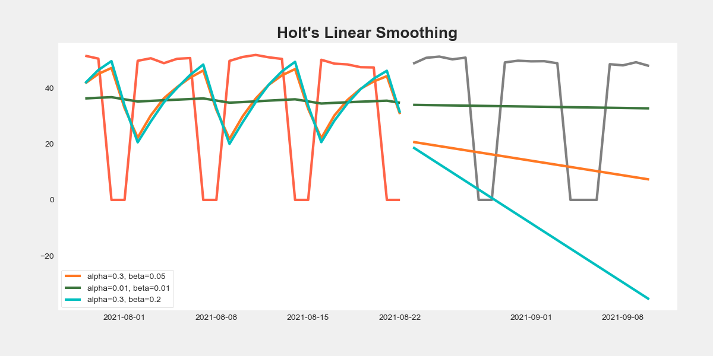

# Airlines Stocks Evaluation 


## Author
* Mia Fryer

## Table of Contents
* [Motivation](#Motivation)
* [Data Sources](#Data_Sources)
* [Feature Engineering/Technical indicators](#Feature_Engineering_Technical_indicators)
* [Data Preparation](#data-preparation)
* [Model Training and Testing](#model-training-and-testing)
* [Analysis](#analysis)
* [Conclusions](#conclusions)
* [Project Structure](#project-structure)

## Motivation
Stock investing without a strategy can be daunting when deciding what to buy. This project aims to bring clarity via a Machine-learning-driven dashboard to analyze and forecast changes amongst the four major American airlines; Southwest, American, Delta, and United airlines. Visualizing closing price performance for these airlines is a valuable tool for quickly identifying trends and making side-by-side comparisons. Both ARIMA/SARIMA and LSTM neural networks produce price forecasts to facilitate investors to make informed investment decisions.


## Data Sources
One of the most critical steps in machine learning and predictive modeling is gathering good data. For this project, the data is loaded from Yahoo Finance using pandas DataReader function.

## Feature Engineering/Technical indicators
Financial analysts use several technical indicators; the ones included in this project are the following:

• Moving Average Convergence Divergence (MACD): A momentum indicator to spot increasing short-term momentum using the difference between a short-term(12) and long-term(26 exponential moving average. Generally speaking, when a short-term moving average crosses below a longer-term average is used to illustrate that the asset's price has been moving downward at a faster rate and that it may be an excellent time to sell. The reverse will also be valid for a bullish momentum, which can be represented with a positive MACD value.



• Bollinger Bands: A statistical chart characterizing the prices and volatility over time. The graph is plotted using the moving average of 20 days and two standard deviations of the rolling average as the upper and lower bound. A common approach when using Bollinger Bands® is to identify overbought or oversold market conditions. When the asset price breaks below the lower band of the Bollinger Bands®, prices have perhaps fallen too much and are due to bounce. On the other hand, when price breaks above the upper band, the market is probably overbought and due for a pullback.



• Relative Strength Index (RSI): A momentum oscillator that ranges from 0 to 100. Values of 70 or above indicate that a security is becoming overbought or overvalued and may be due for a corrective pullback in price. An RSI reading of 30 or below indicates an oversold or undervalued condition. The standard is to use 14 periods to calculate the initial RSI value.

•Simple Risk Evaluation: using daily percentage returns to compare the expected return with the standard deviation of the daily returns as risk.



## Data Preparation
For the regression models (ARIMA, SARIMA), the data was first turned stationary by differencing and taking the log version of the data to remove changing variance. For the deep learning recurrent neural network models (long hsort term memory), the data was first scaled using the min-max scalar from SKlearn.


## Model Training and Testing
The following predictive models were implemented using three main predictive machine learning techniques: ARIMA, SARIMA, Exponential Smoothing, and LSTM on the Southwest airlines stock prices:

<ol start="0">
  <li> ARIMA (baseline)</li>
  <li> ARIMA (gridsearch to find optimal paramters)</li>
  <li>Simple exponential smoothing </li>
  <li>Holt linear smoothing</li>
  <li>Holt-Winter’s seasonal smoothing/li>
  <li>LSTM with single time step</li>
  <li>LSTM with multiple time step</li>
</ol>





## Analysis

LSTM with a single time step expectedly did better than LSTM with a multiple time step with a root mean squares error of 0.8329 instead of 5.3819. ARIMA's best model resulted in a root mean squared error of 0.418, and exponential smoothing forecast has an error of 0.701. Overall, all four different methods generated satisfactory results.

## Conclusions

These predictive models are more accurate for next-day prediction, so it is necessary to combine machine learning modeling with different trading indicators to better the stock analysis and further extrapolate more precise information.

## Next Steps
Predicting stock prices using these models is only half of the story. The result will be even more accurate by using sentimental analysis on the news for these companies to evaluate if there is an upward trend with more positive news.

## Project Structure
```
.
├── 01_EDA.ipynb
├── 02_ARIMA_SARIMA.ipynb 
├── 03_Expoential_model.ipynb  
├── 04_LSTM_single_step.ipynb
├── 05_LSTM_multstep.ipynb.ipynb
├── 06_Multiclass_Modeling.ipynb
├── README.md
├── Airline_Stocks_Presentation.pdf
├── gitignore
└── images
 
   
```
